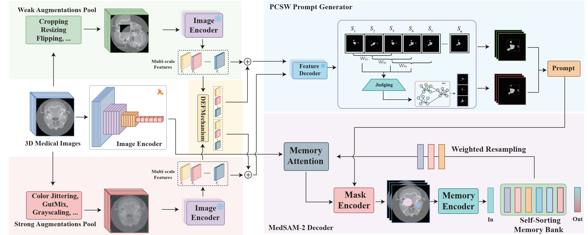

# SSS: Semi-Supervised SAM-2 with Efficient Prompting for Medical Imaging Segmentation
This is the code repository for the paper:

> **SSS: Semi-Supervised SAM-2 with Efficient Prompting for Medical Imaging Segmentation**
> 
>[Hongjie Zhu](https://github.com/Potato2187/), Xiwei Liu, Rundong Xue, [Zeyu Zhang](https://steve-zeyu-zhang.github.io/)†, Yong Xu, Daji Ergu, [Ying Cai](https://ieeexplore.ieee.org/author/37087137422)* and [Yang Zhao](https://yangyangkiki.github.io/)
>
>*Corresponding author. †Project lead.
>



## Introduction
In the era of information explosion, efficiently leveraging large-scale unlabeled data while minimizing the reliance on high-quality pixel-level annotations remains a critical challenge in the field of medical imaging. Semi-supervised learning (SSL) enhances the utilization of unlabeled data by facilitating knowledge transfer, significantly improving the performance of fully supervised models and emerging as a highly promising research direction in medical image analysis. Inspired by the ability of Vision Foundation Models (e.g., SAM-2) to provide rich prior knowledge, we propose SSS (Semi-Supervised SAM-2), a novel approach that leverages SAM-2’s robust feature extraction capabilities to uncover latent knowledge in unlabeled medical images, thus effectively enhancing feature support for fully supervised medical image segmentation. Specifically, building upon the single-stream “weak-to-strong” consistency regularization framework, this paper introduces a Discriminative Feature Enhancement (DFE) mechanism to further explore the feature discrepancies introduced by various data augmentation strategies across multiple views. By leveraging feature similarity and dissimilarity across multi-scale augmentation techniques, the method reconstructs and models the features, thereby effectively optimizing the salient regions. Furthermore, a prompt generator is developed that integrates Physical Constraints with a Sliding Window (PCSW) mechanism to generate input prompts for unlabeled data, fulfilling SAM-2’s requirement for additional prompts. Extensive experiments demonstrate the superiority of the proposed method for semi-supervised medical image segmentation on two multi-label datasets, i.e., ACDC and BHSD. Notably, SSS achieves an average Dice score of 53.15 on BHSD, surpassing the previous state-of-the-art method by +3.65 Dice.

## Environment Setup

To set up the environment for SSS, follow these steps:

```sh
# create a clean conda environment from scratch
conda create --name SSS python=3.7
conda activate SSS

# install pip
conda install ipython
conda install pip

# install required packages
pip install -r requirements.txt
```
## Training Cases
 #### Download ACDC or BHSD or your own dataset and put in the ``data`` folder, create the folder if it does not exist 
 
 ### 2D case - REFUGE Optic-cup Segmentation from Fundus Images

**Step1:** Download pre-processed [REFUGE](https://refuge.grand-challenge.org/) dataset manually from [here](https://huggingface.co/datasets/jiayuanz3/REFUGE/tree/main), or using command lines:

 ``wget https://huggingface.co/datasets/jiayuanz3/REFUGE/resolve/main/REFUGE.zip``

 ``unzip REFUGE.zip``

 **Step2:** Run the training and validation by:
 
``python train_2d.py -net sam2 -exp_name REFUGE_MedSAM2 -vis 1 -sam_ckpt ./checkpoints/sam2_hiera_small.pt -sam_config sam2_hiera_s -image_size 1024 -out_size 1024 -b 4 -val_freq 1 -dataset REFUGE -data_path ./data/REFUGE``

 ### 3D case - Abdominal Multiple Organs Segmentation
 
 **Step1:** Download pre-processed [BTCV](https://www.synapse.org/#!Synapse:syn3193805/wiki/217752) dataset manually from [here](https://huggingface.co/datasets/jiayuanz3/btcv/tree/main), or using command lines:

 ``wget https://huggingface.co/datasets/jiayuanz3/btcv/resolve/main/btcv.zip``

 ``unzip btcv.zip``

**Step2:** Run the training and validation by:


 ``python train_3d.py -net sam2 -exp_name BTCV_MedSAM2 -sam_ckpt ./checkpoints/sam2_hiera_small.pt -sam_config sam2_hiera_s -image_size 1024 -val_freq 1 -prompt bbox -prompt_freq 2 -dataset btcv -data_path ./data/btcv``
